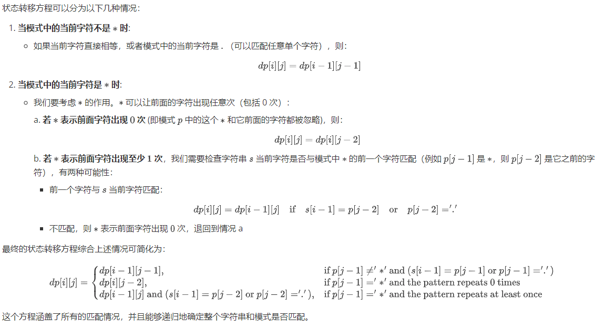

- [LeetCode-TS](#leetcode-ts)
  - [0001-两数之和](#0001-两数之和)
  - [0002-两数相加](#0002-两数相加)
  - [0003-无重复字符的最长子串](#0003-无重复字符的最长子串)
  - [0004-寻找两个有序数组的中位数](#0004-寻找两个有序数组的中位数)
  - [0005-最长回文子串](#0005-最长回文子串)
  - [0006-Z 字形变换](#0006-z-字形变换)
  - [0007-整数反转](#0007-整数反转)
  - [0008-字符串转换整数 (atoi)](#0008-字符串转换整数-atoi)
  - [0009-回文数](#0009-回文数)
  - [0010-正则表达式匹配](#0010-正则表达式匹配)
  - [0011-盛最多水的容器](#0011-盛最多水的容器)
  - [0012-整数转罗马数字](#0012-整数转罗马数字)
  - [0013-罗马数字转整数](#0013-罗马数字转整数)
  - [0014-最长公共前缀](#0014-最长公共前缀)
  - [0015-三数之和](#0015-三数之和)
  - [0027-移除元素](#0027-移除元素)
  - [0031-下一个排列](#0031-下一个排列)
  - [0036-有效的数独](#0036-有效的数独)
  - [0053-最大子序和](#0053-最大子序和)
  - [0062-不同路径](#0062-不同路径)
  - [0120-三角形最小路径和](#0120-三角形最小路径和)
  - [0146-LRU 缓存](#0146-lru-缓存)
  - [0704-二分查找](#0704-二分查找)
  - [1143-最长公共子序列](#1143-最长公共子序列)

# LeetCode-TS

LeetCode implemented by TypeScript

## 0001-两数之和

思路: 使用一个 map 存储已经遍历过的数字, key 为数字, value 为下标, 遍历数组, 如果 map 中存在 target-nums[i], 则返回 map 中对应的下标和当前下标, 否则将当前数字存入 map 中,

## 0002-两数相加

思路: 遍历两个链表, 将对应位置的数字相加, 如果有进位, 则将进位加到下一位的计算中, 如果两个链表长度不一致, 则将短的链表后面的数字补 0, 直到两个链表都遍历完, 如果最后还有进位, 则将进位加到链表的最后一位,

## 0003-无重复字符的最长子串

思路: 使用一个 map 存储已经遍历过的字符, key 为字符, value 为下标, 遍历字符串, 如果 map 中存在当前字符, 则将当前字符的下标与 map 中对应的下标比较, 取较大的那个, 作为新的起始下标, 否则将当前字符存入 map 中, 然后计算当前下标与起始下标的差值, 与最大长度比较, 取较大的那个,

## 0004-寻找两个有序数组的中位数

**难点: 时间复杂度为 O(log(m+n))**

思路: 将两个数组分别分成两部分, 左边部分的长度为 k, 右边部分的长度为 m+n-k, 如果左边部分的最大值小于等于右边部分的最小值, 则左边部分的最大值就是中位数, 否则 k 需要减小, m+n-k 需要增大, 然后继续二分查找,

关键: findKth 函数的实现, 该函数的作用是找到两个数组中第 k 小的数字, 参考: [p_0004](./src/p_0004.ts)

## 0005-最长回文子串

**难点: 中心扩展函数的实现**

思路: 遍历字符串, 以当前字符为中心, 向两边扩展, 如果两边的字符相等, 则继续扩展, 否则停止扩展, 然后比较当前回文串的长度与最大回文串的长度, 取较大的那个, 最后返回最大回文串,

## 0006-Z 字形变换

思路: 模拟或者找规律

## 0007-整数反转

思路: 使用字符串进行比较
优化: 取模运算

## 0008-字符串转换整数 (atoi)

思路: 遍历, 使用状态机

## 0009-回文数

思路: 转换为字符串, 然后判断是否为回文串

## 0010-正则表达式匹配

**难点: 动态规划**

思路: 动态规划, $dp[i][j]$ 表示 $s$ 的前 $i$ 个字符与 $p$ 的前 $j$ 个字符是否匹配

状态转移方程:

## 0011-盛最多水的容器

思路: 双指针, 从两边向中间移动, 每次移动高度较小的那个指针, 因为如果移动高度较大的那个指针, 容器的面积只会变小,

## 0012-整数转罗马数字

思路: 贪心算法, 从大到小依次遍历, 如果当前数字大于等于当前罗马数字, 则先算需要添加多少个当前罗马数字, 然后将当前数字减去当前罗马数字, 直到当前数字为 0,

在这里使用贪心算法的正确性:

-   这个算法的贪心策略是始终选择当前能选择的最大值, 这种策略的正确性在于罗马数字的特殊性质. 

-   罗马数字的构造方式是基于每个位置可以表示的最大值, 例如 1（I）, 4（IV）, 5（V）, 9（IX）, 10（X）, 40（XL）, 50（L）, 90（XC）, 100（C）, 400（CD）, 500（D）, 900（CM）, 1000（M）. 这些都是每个位置可以表示的最大值, 而且每个更大的值都包含了更小的值. 例如, 900（CM）包含了 100（C）和 1000（M）. 

-   因此, 从大到小选择能表示的数, 可以保证不会错过更优的解. 例如, 如果我们有一个数是 4, 我们首先会尝试是否可以用 5（V）来表示, 但是 5 大于 4, 所以我们不能选择 5, 然后我们会尝试 4（IV）, 发现 4 可以被表示, 所以我们选择了 4, 这样就得到了最优解. 

## 0013-罗马数字转整数

思路: 从左到右遍历, 记录当前的罗马数字和前一个罗马数字, 如果当前罗马数字大于等于前一个罗马数字, 则加上当前罗马数字, 否则减去当前罗马数字, 最后返回结果

初始值: preValue = 0, result = 0

## 0014-最长公共前缀

思路: 先找最短的字符串, 然后遍历字符串数组, 从第一个字符开始, 依次比较每个字符串的第一个字符, 如果都相等, 则继续比较下一个字符, 否则返回当前的最长公共前缀

## 0015-三数之和

思路: 确定一个值, 然后使用一个两数之和的辅助函数, 从剩下的数组中找到两个数, 使得三个数的和为 0 (注意去重)

问题: 为什么在twoSum函数中, 找到一个解后, 左指针和右指针都需要移动?

解答: 

- 唯一性: 
  
  由于数组nums已经排序, 对于确定的目标值target, 任何一个特定的元素值只能配对另一个唯一的元素值以达成和为target. 一旦我们找到了这样的配对, 为了避免重复的配对, 需要移除其中的两个数（即需要跳过所有之后重复的两个数）, 而最直接的方式就是同时移动左右指针. 

- 无效组合排除: 
  
  假设我们只移动左指针或者只移动右指针, 将会导致下一个组合依然包含之前用过的那个数, 根据唯一性, 这个新组合必定不满足和为target, 因为如果另一边的数存在可以与之匹配的值, 它们应该在之前的操作中就已经被找到. 

- 举例说明: 
  
  如果数组nums排序后为[-4, -1, -1, 0, 1, 2], 并且target是-1. 当左指针指向第一个-1, 右指针指向2时, 我们得到了符合条件的一对[-1, 2]. 接下来: 

  如果我们只移动左指针, 左指针会移到下一个-1, 而右指针仍然在2上, 这样我们得到的新组合[-1, 2]与之前的相同, 没有意义. 

  如果我们只移动右指针, 右指针会移到1, 但左指针仍然指向-1, 这样我们得到的新组合[-1, 1]不满足总和为-1. 

  因此, 适当的做法是左指针右移, 跳过重复的-1, 右指针左移, 跳过重复的2, 从而寻找新的可能组合. 在实际代码中, 还需要加入循环来跳过所有重复的数, 确保返回的结果中没有重复的组合. 

## 0027-移除元素

思路: 双指针, 一个指针指向当前需要判断的元素, 另一个指针指向当前需要放置元素的位置, 如果当前元素不等于 val, 则将当前元素放到第二个指针的位置, 然后两个指针都向后移动一位, 否则只移动第一个指针

## 0031-下一个排列

思路: 从右向左遍历, 找到第一个不满足升序的数, 然后从右向左遍历, 找到第一个大于该数的数, 交换这两个数, 然后将第一个数后面的数进行升序排序

问题: 为什么遍历完之后排序可以直接进行双指针交换, 而不需要sort方法? 

原因: 从右向左遍历, 找到第一个不满足升序的数, 交换之后, 该数后面的数一定是**降序**的, 所以直接进行双指针交换即可

## 0036-有效的数独

思路: 使用set检查即可

## 0053-最大子序和

思路: 动态规划, $dp[i]$ 表示以 $nums[i]$ 结尾的最大子序和

状态转移方程: $dp[i] = max(dp[i-1] + nums[i], nums[i])$

解释: 对于一个位置上的$nums[i]$, 它只有两个选择:
1. 要么加入前面的 SubArray, 形成一个和更大的 SubArray; 
2. 要么不加入前面的 SubArray, 自己作为新的 SubArray 的起点. 

优化: 由于不需要记录所有的状态, 所以可以使用一个变量来记录前一个状态, 使空间复杂度为O(1)

## 0062-不同路径

思路: 动态规划

## 0120-三角形最小路径和

思路: 二维动态规划

优化: 由于dp[i][j]只与dp[i-1][j]和dp[i-1][j-1]有关, 所以可以降维, 使空间复杂度为O(n)

可以降维的情况:
- 状态压缩: 
  - 如果第二维度（或者说其中一个维度）的所有值都只依赖于前一步的同一个值, 那么可以把这个维度“压缩”掉. 换句话说, 如果dp[i][j]总是从dp[i-1][j]转移来, 其中j是固定的, 那么可以通过只保留一个维度的数组来覆盖更新这个状态. 
  - 如果问题的某一维度的取值范围非常小, 可以使用位运算的方法将多个状态压缩到一个整数中处理. 

## 0146-LRU 缓存

思路: 使用 Map 和 双向链表实现, 使得 get 和 put 的时间复杂度都为 O(1)

要点: 在面试中, 最好是具体实现一个双向链表 / 最好初始化一个头结点和尾结点减少边界判断

## 0704-二分查找

思路: l = 0, r = nums.length - 1, m = (l + r) / 2

## 1143-最长公共子序列

思路: 动态规划, $dp[i][j]$ 表示 $text1$ 的前 $i$ 个字符与 $text2$ 的前 $j$ 个字符的最长公共子序列的长度

状态转移方程:

$$
dp[i][j] = \begin{cases}
0, & i = 0 \text{ or } j = 0 \\
dp[i-1][j-1] + 1, & text1[i] = text2[j] \\
max(dp[i-1][j], dp[i][j-1]), & text1[i] \neq text2[j]
\end{cases}
$$

当 $p[i] \neq q[j]$ 时, $p[i]$ 和 $q[j]$ 不可能同时出现在 $p$ 和 $q$ 的最长公共子序列中, 因此 $dp[i][j]$ 的值只能由 $dp[i-1][j]$ 和 $dp[i][j-1]$ 中的较大值决定
